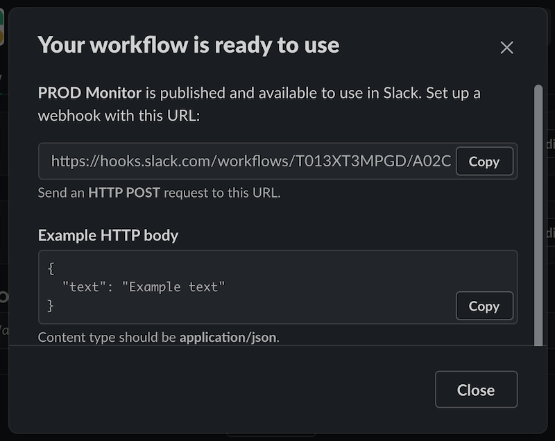

# Logging and notifying about rare events with Slack Webhooks and Log4j

### Table of Contents
* [Introduction](#introduction)
* [Creating and configuring Slack Workflow with Webhook trigger](#creating-and-configuring-slack-workflow-with-webhook-trigger)
* [Configuring *Log4j*](#configuring-log4j)
* [Limitations and other consideration](#limitations-and-other-consideration)

<a name="introduction"></a>
## Introduction

Have you ever logged something like this in your code?

```java
  logger.warn("something terrible has happened")
```

Indeed `WARN` log level is often used to indicate that something odd has happened in your application logic, but
not too critical that you can't recover from (in that case `ERROR` level would be appropriate).
Almost by definition this is about rare events that are hard to observe or reproduce.
Developers have nothing better than to log as much detail as possible about the oddity, so when it happens again they
would have at least some data in the logs to help.

But how do you know that specific event occurred in your application?  Regularly checking the logs is not an option for
something that happens once in a blue moon. Especially when logs are huge, numerous and are stored in restricted
locations. [Advanced logs management solutions](https://www.elastic.co/what-is/elk-stack) can definitely help, but
such tools are often not available to developer, and when they are, their learning curve is quite steep.

Are there alternatives exist at the intersection of logging and notification concerns that could be a simpler solution
to this problem?

Recently, I learned about interesting Slack's feature called [Workflows](https://api.slack.com/workflows) that when
used in combination with properly configured logging library may offer such alternative.

> Workflows are automated multi-step tasks or processes that can run right in Slack,
> or connect with other tools and services.
> Workflows in Slack can be as simple or as complex as you’d like, and typically don’t require writing any code.
>
> If you’re a developer or have some experience with code,
> you may want to create a workflow triggered by an event in an external
> service (like an internal tool your company uses) with a webhook.

[Webhook](https://slack.com/intl/en-ca/help/articles/360041352714-Create-more-advanced-workflows-using-webhooks) is an
auto-generated, unique URL that Slack provides for your Workflow, so it can be triggered by POST'ing a JSON payload
containing Workflow's variables to it:

> Slack will generate a unique request URL for your workflow once you publish it,
> and you can configure your webhook to pass information to Slack via the HTTP request body.
> Any data your webhook sends to Slack can be referenced in subsequent workflow steps by creating variables.

<a name="creating-and-configuring-slack-workflow-with-webhook-trigger"></a>
## Creating and configuring Slack Workflow with Webhook trigger

Here I will guide you through the steps required to create and configure a Workflow with Webhook trigger in Slack, so
that when triggered it will post a given text message to specific Slack channel: 

1. Select existing channel or create new (e.g. "#prod-issues")
2. Go to channel's details (right click on channel name, select "Open channel details")
3. In channel details dialog open "Integrations" tab
4. In "Workflow" section click on "Add a workflow"
5. In the "Workflow Builder" dialog click on "Create"
6. Give your workflow a name (e.g. "PROD Monitor") and click on "Next"
7. Select "Webhook" in the "Choose a way to start your workflow" dialog
8. In the "Webhook" dialog click on "Add variable"
9. Enter key named "text" of the "Text" Data type and click on "done"
10. In the "Webhook" dialog click on "Next"
11. In the newly opened dialog click on "Add Step"
12. In the "Add a workflow step" dialog select "Send a message" step by clicking on "Add"
13. In the "Send a message" dialog select channel from step #1 in the "Send this message to" drop-down list
14. Click on "Insert a variable" link right below "Message Text" editor and select "text" variable added in step #9
15. In the editor click on a "Code block" icon to embed "text" variable inside it 
16. Click on "Save"
17. Now that you're back to your Workflow Builder dialog - click on "Publish"

You will be presented with "Your workflow is ready to use" dialog with unique Webhook URL. Copy it.



You can now post messages to your workflow's channel with simple `curl` command:

```
% curl -X POST -H 'Content-type: application/json' --data '{"text":"Hello Workflow"}' https://hooks.slack.com/workflows/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
```


<a name="configuring-log4j"></a>
## Configuring *Log4j*

To make your Java (or Kotlin, why not?) application able to send notifications to Slack, we can configure *Log4j*'s
standard [`<Http>`](https://logging.apache.org/log4j/2.x/manual/appenders.html#HttpAppender) appender with
customized [`<PatternLayout>`](https://logging.apache.org/log4j/2.x/manual/layouts.html#PatternLayout),
and make certain logger(s) with certain log level(s) to use such an appender.

The following *Log4j* configuration makes any child logger of the `com.example` parent at `WARN` log level
to send messages using `<SlackProdMonitorWebhook>` appender (in addition to `<Console>` one):
```
<?xml version="1.0" encoding="UTF-8"?>
<Configuration status="WARN">
    <Appenders>
        <Console name="Console" target="SYSTEM_OUT">
            <PatternLayout pattern="%d{ISO8601} [%t] %-5level %logger - %msg%n"/>
        </Console>
        <Http name="SlackProdMonitorWebhook"
              url="https://hooks.slack.com/workflows/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"
              connectTimeoutMillis="2000"
              readTimeoutMillis="1000">
            <Property name="Content-type">application/json</Property>
            <PatternLayout pattern="{&quot;text&quot;:&quot;[%t] %logger - %enc{ %m }{JSON}&quot;}"/>
        </Http>
    </Appenders>
    <Loggers>
        <Logger name="com.example">
            <AppenderRef ref="SlackProdMonitorWebhook" level="warn"/>
        </Logger>

        <Root level="info">
            <AppenderRef ref="Console"/>
        </Root>
    </Loggers>
</Configuration>
```

Or, if you need a dedicated Slack logger to be used with varying levels, you can configure it with the following
`<Loggers>` configuration (you may also consider adding `%-5level` specifier and remove `%logger` from the appender's
layout pattern, since here level may vary, while logger will always be `SlackProdMonitorWebhook`):
```
<Loggers>
    <Logger name="SlackProdMonitorWebhook" level="debug">
        <AppenderRef ref="SlackProdMonitorWebhook"/>
    </Logger>

    <Root level="info">
        <AppenderRef ref="Console"/>
    </Root>
</Loggers>
```

This is how you access *SlackProdMonitorWebhook* logger in your code: 

```kotlin
val logger = LogManager.getLogger("SlackProdMonitorWebhook")
logger.warn("something terrible has happened")
```

<a name="limitations-and-other-consideration"></a>
## Limitations and other consideration

Webhook workflows are limited to [one request per second](https://api.slack.com/docs/rate-limits#overview).
Obviously, loggers that make use of Slack Webhook should only be used to notify about rare events.

Also be mindful of the fact that *Log4j*
[`<Http>`](https://logging.apache.org/log4j/2.x/manual/appenders.html#HttpAppender) appender blocks execution of
application code for duration of network call. It's important to ensure that appender's configured connection and read
timeouts are appropriate for your application. If latency is critical,
consider using *Log4j* [`<Async>`](https://logging.apache.org/log4j/2.x/manual/appenders.html#AsyncAppender) appender
to wrap `<Http>` one.

Another important consideration is privacy. Do not log data that may be considered as private or sensitive.

Lastly, due to limitation of `PatternLayout` to define Webhook's JSON request body, logger's methods that take
instance of `Throwable` as last argument are not supported (stacktrace text comes after JSON and causes parsing error
on Slack side).

###### *August 29, 2021*
